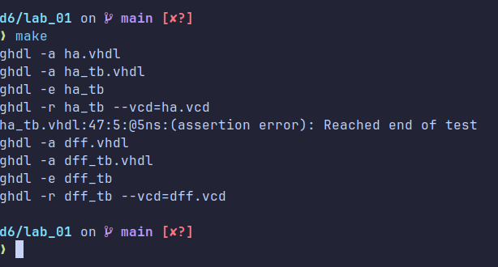
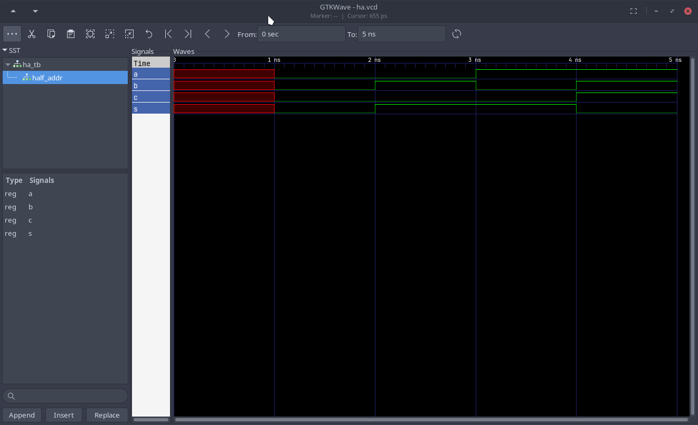
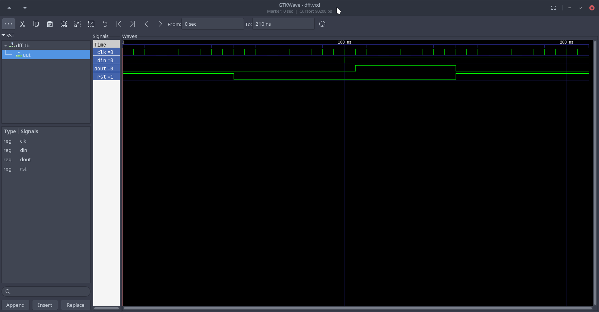

# Lab 01

## Downloading GHDL

On my laptop I am using Arch Linux, so there was an Arch User Repository Package
that I could download to install GHDL. It needed to be compiled from source, and
also needed an older version of gcc 11, so I had to compile that from source as
well. After about 20 minutes compiling I was good to go. GTKWave had a package
already available in the community repositories, so I just installed that and
went on with my day.

## Creating a Makefile

I'm not great at making these, but I figured it would be easier to create one to
run the necessary commands for compiling and running the different VHDL files in
case I wanted to play around with them.

What I created has two targets, one for the D Flip-Flop circuit, and one for the
Half Adder (as well as a target to run both at the same time).

## Compiling Both Examples Output

## GTKWave Outputs

### Half Adder

### D Flip-Flop

