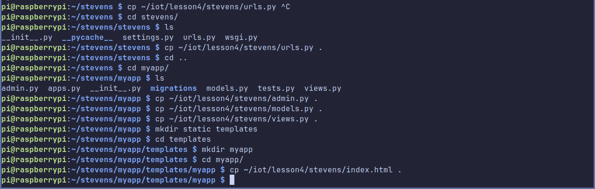

# Lab 04

Lab 4 asks us to learn the basics of the Django and Flask web frameworks for
Python.

## Pi Setup

I don't particularly want to set up databases and things like that on my laptop,
so I'm going to use my Raspberry Pi 4 running the latest version of PiOS to do
this lab.

I set up passwordless ssh on the pi so that I don't have to type in my password
every time, and installed [ZeroTier](https://www.zerotier.com/) so that I can
connect to the pi while its on my home network without having to deal with a VPN
or port forwarding. ZeroTier has a simple script to install it, and ssh can be
enabled within `sudo raspi-config` on the pi, and an ssh key copied to it with
`ssh-copy-id`. I also had to change the default locale manually for the pi in
`raspi-config`, which I suspect I would've been prompted to on first boot if I
had been connected to a monitor.

## Django

### Packages Install

I have no idea why the lab instructions say to use pip to install Django, its
completely unnecessary and already packaged in the repositories. Don't install
things with pip using sudo unless you want to start breaking things on your
system (I outlined the issues with this in [lab 3](/lab_03/lab_03.md)). Just use
`sudo apt install <package>` with the following package names, and you'll be
fine.

```auto
python3-django
python3-djangorestframework
python3-mysqldb
mariadb-server
mariadb-client
apache2
php
php-mysql
```

### MariaDB Config


### Stevens Project

#### Start a Django Project

Forgot to take screenshots of this bit.

#### Start a Django App

Forgot to take screenshots of this bit.

#### Create MySQL Database


#### Edit settings\.py


#### Copy Files From IOT




#### Enable Google Maps API

I don't want to give google my credit card.

#### Make Migrations Stuff


#### Adding Database Entry


#### Final Site


### My CPU Project

#### Initial CLI Setup


#### Finishing CLI Setup


#### Django Setup

 
 

#### Final Site CPU


### Django Final Verdict

I was able to complete both Django projects (except for the giving google my
credit card information part).

Did I actually learn anything from doing this? Not really? Django is wildly
complicated compared to other Python web servers I've seen. It seems like the
best way to get something out of this lab would be for it to be multiple weeks,
so we can actually understand what is going on. Given more time we could've
learned about how stuff works on the web (different request types), what
Django's job actually is, and how to build up to something like the project
presented here.

Would I ever use Django again if given the choice? Hell no. I worked with
[FastAPI](https://fastapi.tiangolo.com/) during one of my co-ops, and I would
pick it in a heartbeat again over ever touching Django with a ten-foot pole.

Additionally, if we're likely to keep using Python in our labs, more time needs
to be dedicated to explaining what it is, how to install it, and how to do basic
things with it. I've used Python for years and used it in both of my co-ops. But
just about every student in this class has only had two classes involving
programming before. E115/116, which is utterly useless, and CPE390, which
focuses on very low level topics of computing and confuses many students due to
it being their first introduction to C++.

## Flask

### Flask Hello World


### Alexa Game Thing?

Requires signing in to my personal Amazon account to access the Alexa Developer
Console. I'll pass.

### Flask Final Verdict

The hello world example looks pretty similar to what I did with FastAPI,
defining functions with decorators for the routes / GET / POST, etc., then just
starting the event loop of the program. ¯\\\_(ツ)_/¯

## WordPress / Apache


### Final Verdict

Honestly I have no idea what I just did or why it works.
