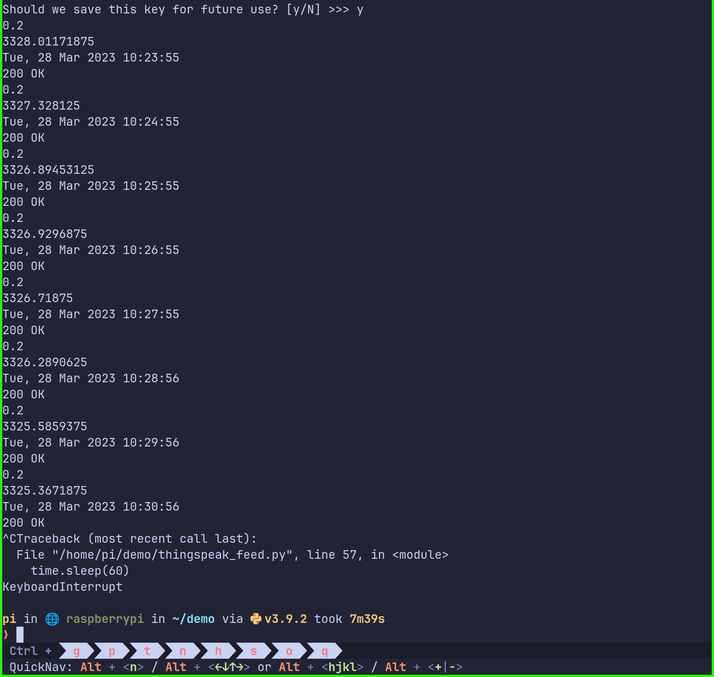
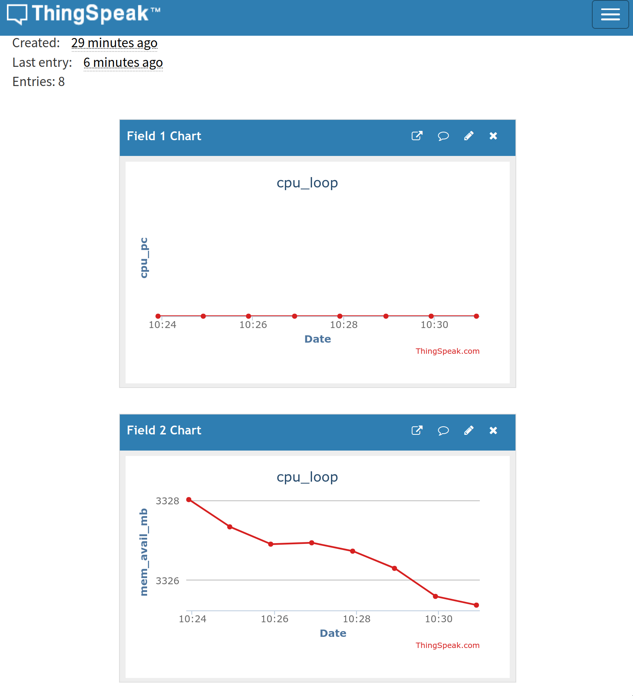
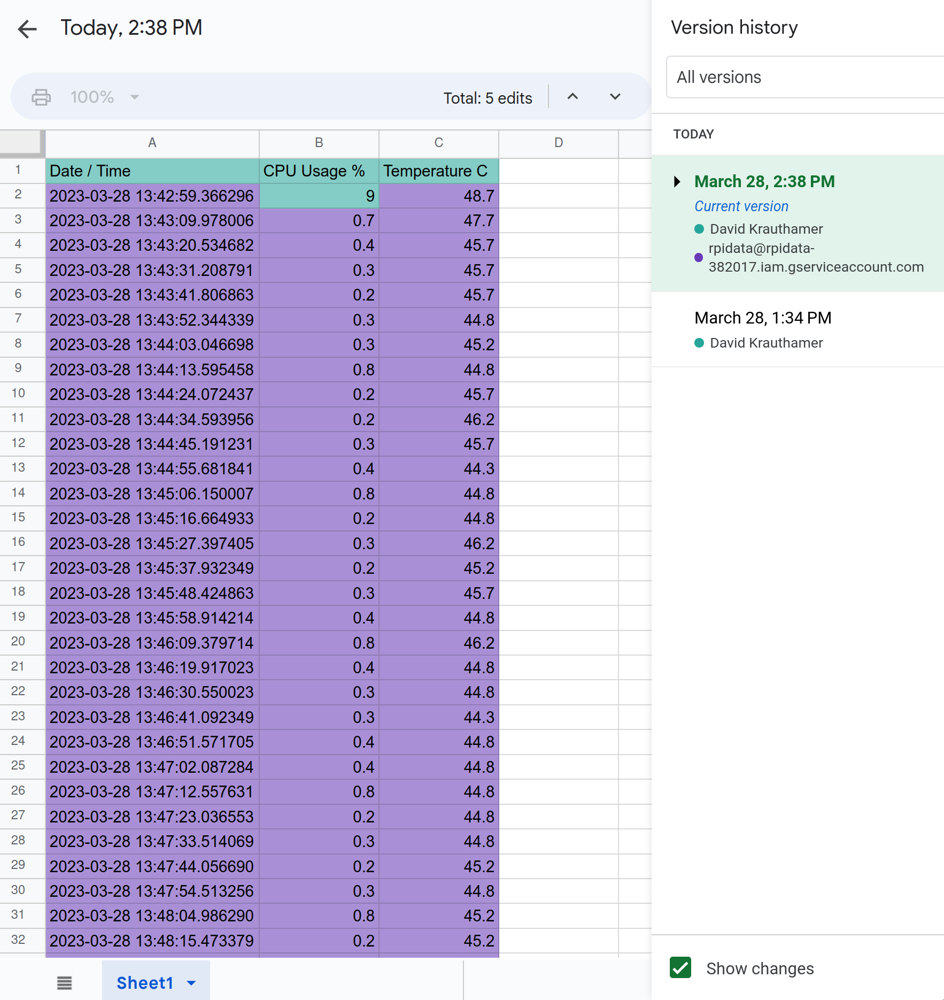

# Lab 07

## ThingSpeak

Logged into ThingSpeak, created a new channel with the associated fields. Copied
the API key and ran thingspeak_feed.py. Here's the output:



Going back to the website the following graphs were generated after a short
while:



## Google Sheets

When I logged into GCP I realized I actually had some old projects still in
there from when I was messing around with stuff from E115. Went ahead and nuked
those and started fresh with the instructions from the IOT repository.

The instructions to get everything setup were a bit wonky to follow, as things
with the right names were more or less in the places described, but were
occasionally an extra click or two away from where the instructions made them
seem to be. I think throwing in some pictures of what to click on would be
helpful, specifically related to GCP and its really unintuitive UI.

Making and sharing the sheet was fine, and you can find it here:
<https://docs.google.com/spreadsheets/d/1TjKupAlmP65xRlSYDpDAAewULEjUYaSVm8hWhMnCSUk/edit?usp=sharing>.
To prove it's the API that made the changes, here's a picture of the version
history:



## A Side Tangent: How Make a Python Virtual Environment

At this point I'm annoyed enough with seeing `sudo pip install` instructions
being given that I'm going to give the absolute basics on how to use a virtual
environment so that you don't break your stuff. See previous labs for my rants
on why installing packages as root with pip is a terrible idea.

I'm going to show how to use tools that come directly with your python
installation, but if you're looking for more advanced tools to use checkout
[Anaconda](https://www.anaconda.com/) (and miniconda, mamba, micromamba, etc.),
or something like [PDM](https://pdm.fming.dev/latest/) or
[Poetry](https://python-poetry.org/). At this time I'm currently using PDM or
occasionally micromamba.

An important note: I'm writing these instructions assuming you're using a pi,
things will be roughly the same on Windows.

### Making The Environment

Included with every Python installation is a module called venv, which can be
used to make a sandbox with its own copy of the Python interpreter and whatever
packages you want in it without touching the rest of your system.

In whatever folder you'd like to make the venv, run the following command in
your terminal of choice:

```bash
python -m venv venv/
# if you'd like to name the sandbox folder something else:
python -m venv <folder_name_here>
```

This will create a folder named `venv` containing the following:

```text
bin  include  lib  lib64  pyvenv.cfg  share
```

The main thing to care about is what is in the `bin` folder, which looks like
this:

```text
activate      activate.fish  easy_install      pip   pip3.9  python3
activate.csh  Activate.ps1   easy_install-3.9  pip3  python  python3.9
```

You can see that there's a copy of `pip` and `python`, along with a few aliases
for each of them (`pip3`, `pip3.9`, `python3`, and `python3.9`). The specific
version aliases will be different for you depending on which version of Python
is installed on your system. For my Raspberry Pi running PiOS (Debian 11) I have
aliases for python 3.9.

### Installing packages

There are also a bunch of files called `activate` with different extensions.
These are your gateway to accessing the virtual environment. Here's when you
should use each of these different files, which depends on your shell / system:

| Platform | Shell      | Command to activate virtual environment |
| -------- | ---------- | --------------------------------------- |
| POSIX    | bash / zsh | `source <venv>/bin/activate`            |
| POSIX    | fish       | `source <venv>/bin/activate.fish`       |
| POSIX    | csh/tcsh   | `source <venv>/bin/activate.csh`        |
| POSIX    | PowerShell | `<venv>/bin/Activate.ps1`               |
| Windows  | cmd.exe    | `<venv>\Scripts\activate.bat`           |
| Windows  | PowerShell | `<venv>\Scripts\Activate.ps1`           |

Run the command in associated with your operating system and shell, replacing
`<venv>` with the folder containing your virtual environment.

From now until you run `deactivate`, any time you call `python` or `pip` it will
be associated with the virtual environment, and not your system install. You can
now install whatever packages you need, and they won't touch anything globally.
As long as you don't delete the virtual environment folder then you can activate
it again to access those packages at any time.

### Final Note

One final important note, **do not commit this virtual environment folder to
git**. It takes up space which requires people to download it when they clone
your repository, and in many cases the libraries that are downloaded are
platform specific and won't work on somebody else's machine.
