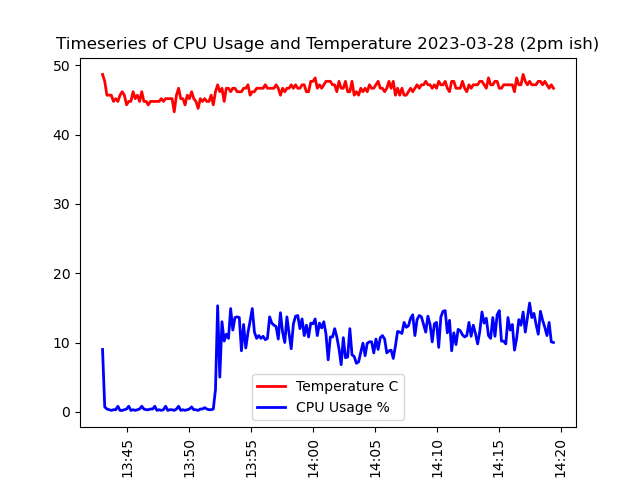
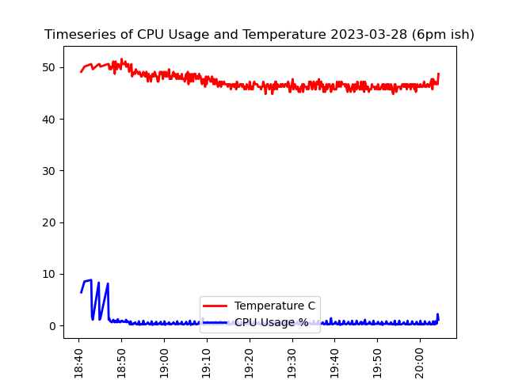
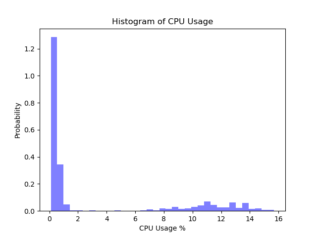
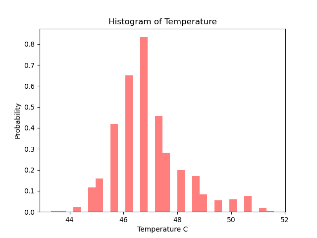
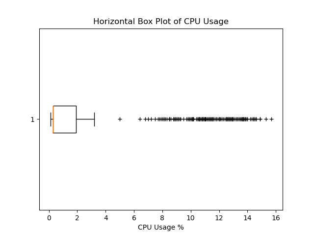
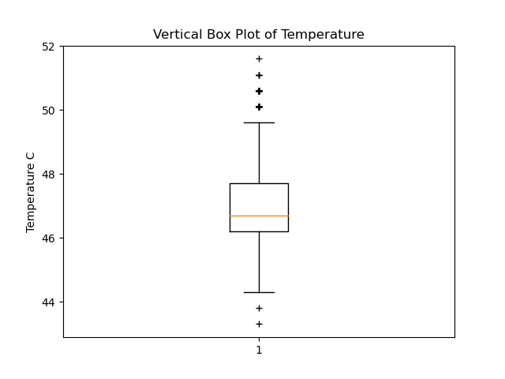
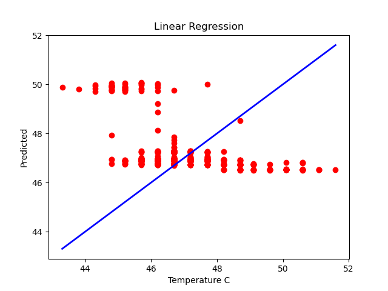

# Lab 08

## 8A: Examples

### Review and Run Python code

#### pyplot_simple.py


#### simple_plot.py


#### pyplot_formatstr.py


#### ticklabels_demo_rotation.py


#### pyplot_three.py


#### pyplot_two_subplots.py


#### pyplot_scales.py


#### pyplot_annotate.py


#### major_minor_demo1.py


#### legend_demo.py


### Histograms, box plots, regression, and interpolation

#### scatter_demo.py


#### histogram_demo_features.py


#### pyplot_text.py


#### histogram_demo_extended.py


#### boxplot_demo.py


#### linreg.py


#### interpolation.py


### Classification, cross-validation (CV), and support-vector machine (SVM)

#### plot_lda.py


#### plot_lda_qda.py


#### plot_cv_predict.py


#### plot_cv_diabetes.py


#### traffic.py


### Titanic example

#### titanic_1.py


#### titanic_2.py


## 8B: Data Analysis

### My Plots From My Data
















### What I Changed From Provided Code

#### plt_cv2.py

##### Pandas Glob Import to pd

```python
# Old
from pandas import *
# New
import pandas as pd
pd.read_csv("my_nonexistant_file.csv")
```

Glob imports like this are usually not a good idea, as they load in everything
in the module at once and put it into the global namespace, which increases the
probablity of name conflicts with other functions / classes, etc.

##### Used plt.savefig() to save the plot

```python
import matplotlib.pyplot as plt
# Do your plot stuff before this line 
plt.savefig("my_nonexistant_file.png")
```

#### plt_final.py

##### Time Series Split

I first converted the date / time column from a string (I'm pretty sure that's
what it was) to a datetime object (see line 8).

Next I had two distinct sets of data, one from about 2pm and the other from
about 6pm. Graphing them together produces a really ugly graph that with a giant
gap in the middle. I instead made two separate plots and sliced up to the split
for one and after the split for the other. See lines 12-68 for that process.

##### Used plt.savefig() to save the plot

Just like the previous file, I also used savefig() to save the plot.
