# Lab 08

## 8A: Examples

### Review and Run Python code

#### pyplot_simple.py

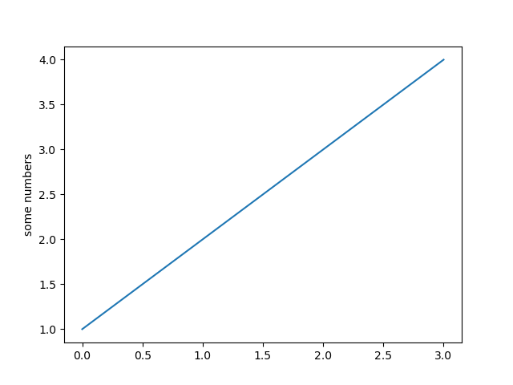

#### simple_plot.py

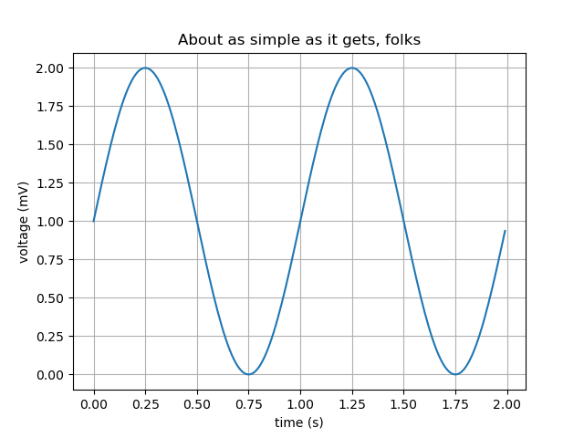

#### pyplot_formatstr.py

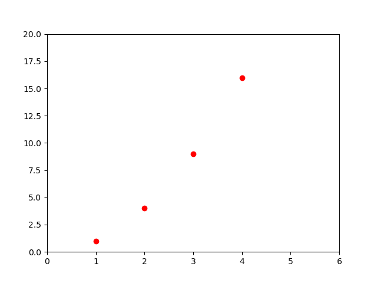

#### ticklabels_demo_rotation.py

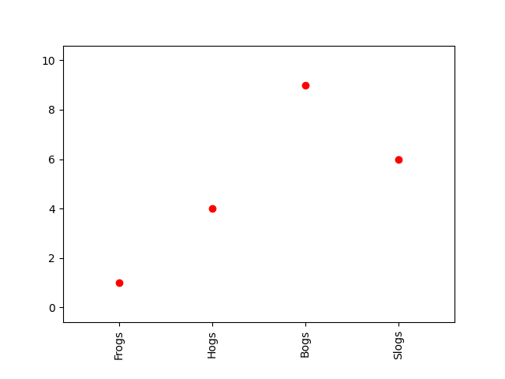

#### pyplot_three.py

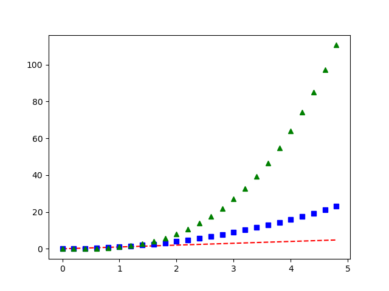

#### pyplot_two_subplots.py

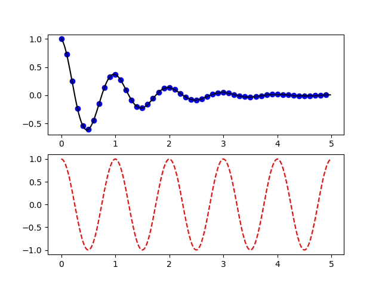

#### pyplot_scales.py

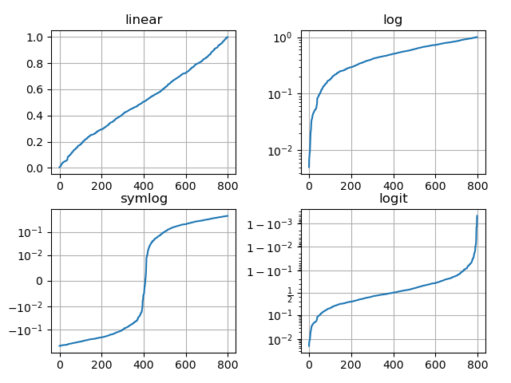

#### pyplot_annotate.py

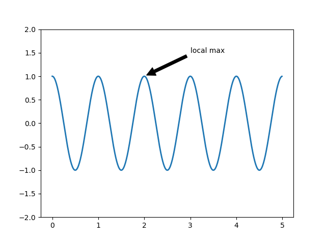

#### major_minor_demo1.py

#### legend_demo.py

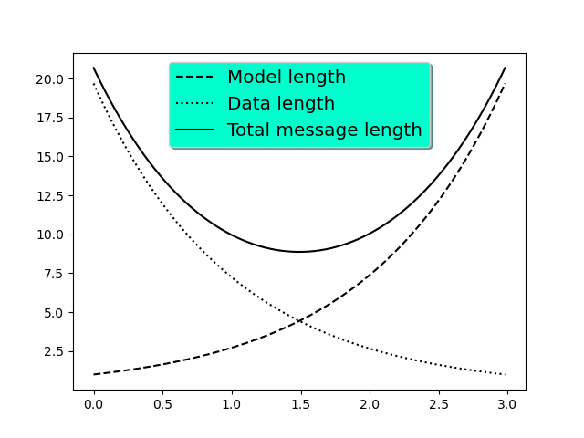

### Histograms, box plots, regression, and interpolation

#### scatter_demo.py

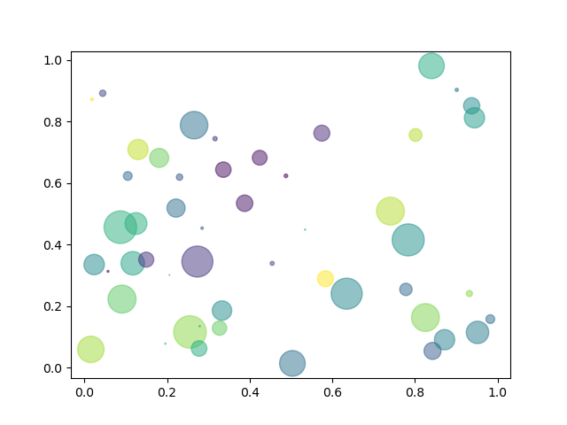

#### histogram_demo_features.py

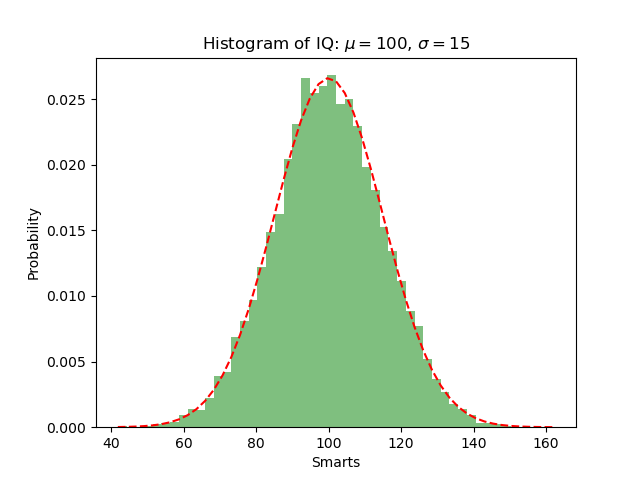

#### pyplot_text.py

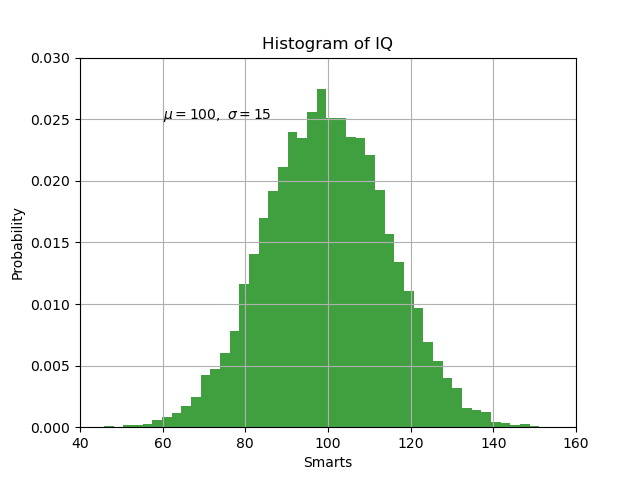

#### histogram_demo_extended.py

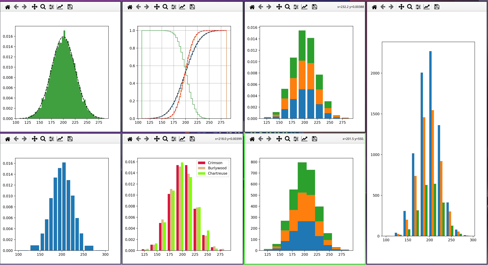

#### boxplot_demo.py

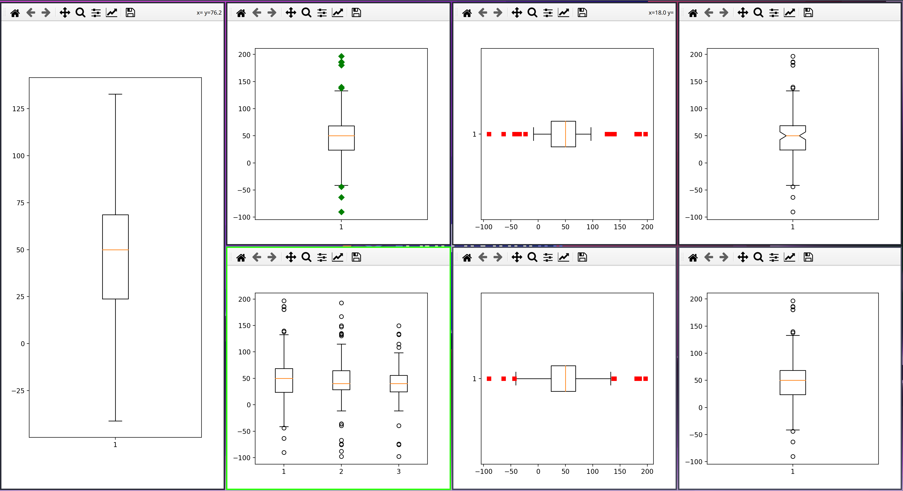

#### linreg.py

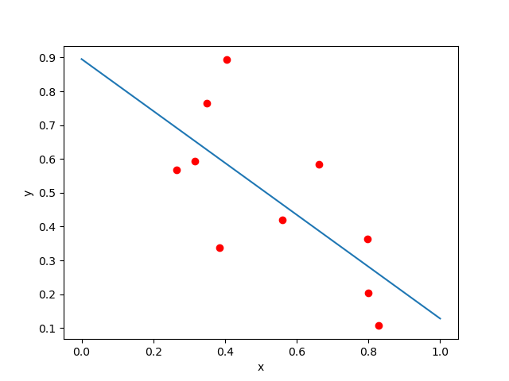

#### interpolation.py

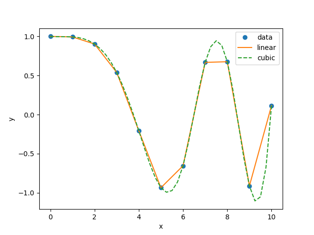

### Classification, cross-validation (CV), and support-vector machine (SVM)

#### plot_lda.py

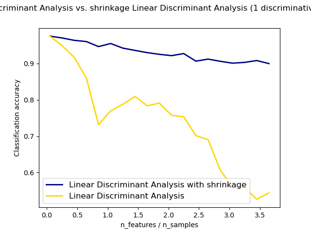

#### plot_lda_qda.py

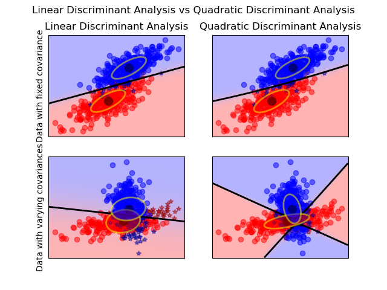

#### plot_cv_predict.py

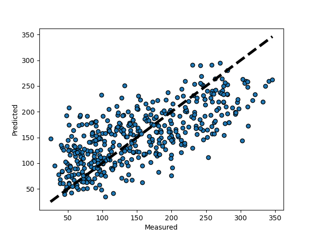

#### plot_cv_diabetes.py

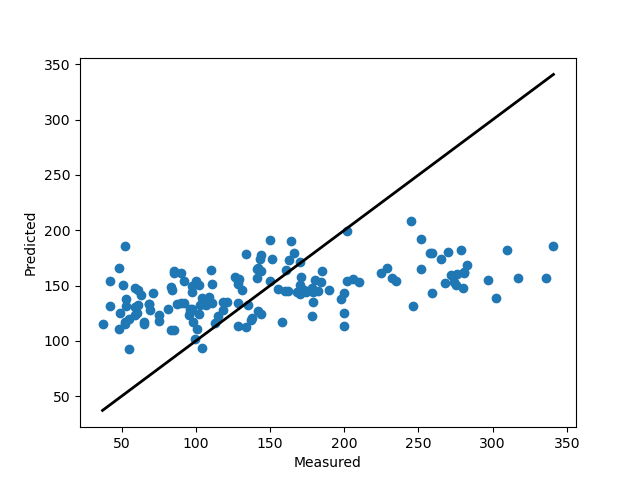

#### traffic.py

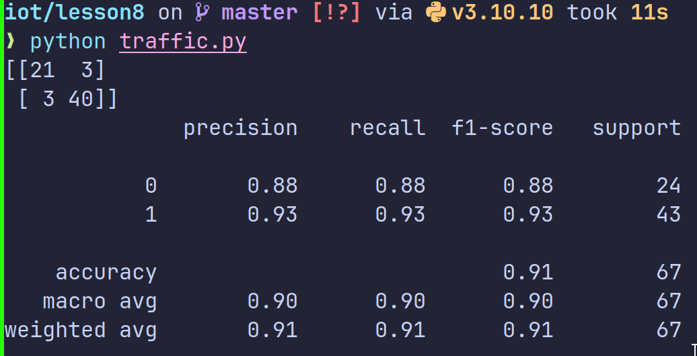

### Titanic example

#### titanic_1.py

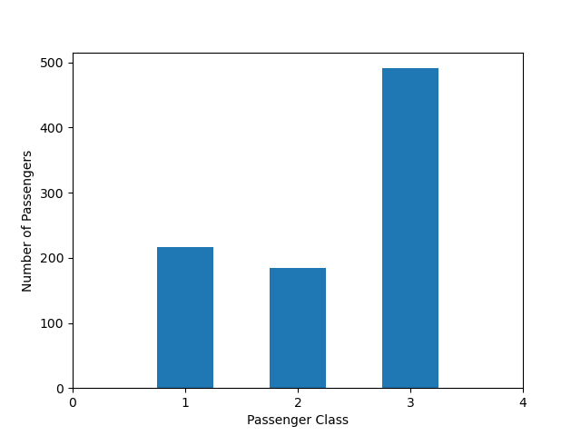

#### titanic_2.py

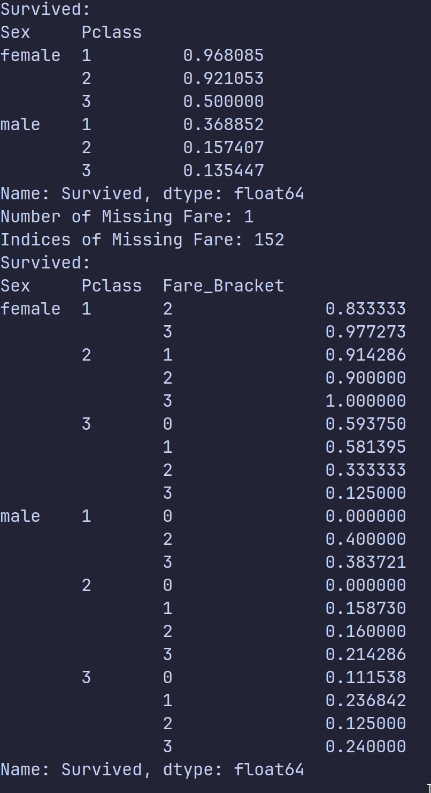

## 8B: Data Analysis
