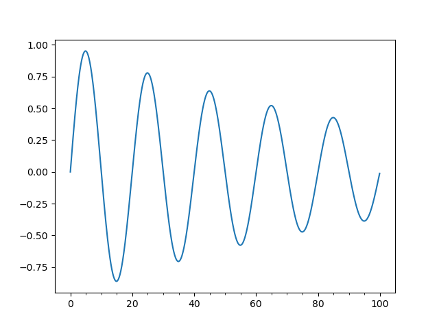

# Lab 08

## 8A: Examples

### Review and Run Python code

#### pyplot_simple.py

#### simple_plot.py

#### pyplot_formatstr.py

#### ticklabels_demo_rotation.py

#### pyplot_three.py

#### pyplot_two_subplots.py

#### pyplot_scales.py

#### pyplot_annotate.py

#### major_minor_demo1.py

#### legend_demo.py

### Histograms, box plots, regression, and interpolation

#### scatter_demo.py

#### histogram_demo_features.py

#### pyplot_text.py

#### histogram_demo_extended.py

#### boxplot_demo.py

#### linreg.py

#### interpolation.py

### Classification, cross-validation (CV), and support-vector machine (SVM)

#### plot_lda.py

#### plot_lda_qda.py

#### plot_cv_predict.py

#### plot_cv_diabetes.py

#### traffic.py

### Titanic example

#### titanic_1.py

#### titanic_2.py

## 8B: Data Analysis
